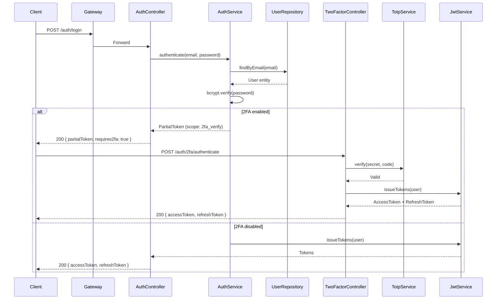

# HLDD_TEMPLATE.md — High-Level Design Document

<!--
  System/module decomposition. How components interact.
  Copy to 2_DESIGN/HLDD/HLDD_01_MODULE_NAME.md
-->

## Document Control

- **Document ID:** HLDD-XXX
- **Module:** <!-- e.g., Auth Service -->
- **Version:** 1.0
- **Status:** Draft | Review | Approved
- **Traces to:** <!-- SRS-001 (2FA Feature), ARCHITECTURE.md -->

---

## 1. Module Overview

### 1.1 Purpose
<!-- One paragraph. What does this module do in the system? -->

### 1.2 Place in System

```
┌──────────────────────────────────────────┐
│              API GATEWAY                  │
│         (routes, auth check)              │
└────────────┬─────────────────────────────┘
             │
    ┌────────┼────────┬──────────────┐
    ▼        ▼        ▼              ▼
┌──────┐ ┌──────┐ ┌──────┐    ┌──────────┐
│ AUTH │ │ USER │ │ORDER │    │ PAYMENT  │
│ SVC  │ │ SVC  │ │ SVC  │    │   SVC    │
└──┬───┘ └──────┘ └──────┘    └──────────┘
   │
   ├── PostgreSQL (auth_db)
   ├── Redis (token blacklist, rate limit)
   └── RabbitMQ → notification-service
```

---

## 2. Module Interface

### 2.1 Provided APIs (What This Module Offers)

| Endpoint | Method | Purpose | Auth |
|----------|--------|---------|------|
| /api/v1/auth/login | POST | Authenticate user | None |
| /api/v1/auth/refresh | POST | Refresh access token | Refresh cookie |
| /api/v1/auth/2fa/setup | POST | Enable 2FA | Access token |
| /api/v1/auth/2fa/verify | POST | Verify 2FA code | Partial token |

### 2.2 Consumed APIs (What This Module Calls)

| Service | Endpoint | Purpose | Circuit Breaker |
|---------|----------|---------|-----------------|
| user-service | GET /internal/users/{id} | Fetch user profile data | Yes (3 failures → open) |
| notification-service | RabbitMQ: auth.events | Send 2FA setup email | Async (fire-and-forget) |

### 2.3 Events Published

| Event | Routing Key | Payload | Consumers |
|-------|------------|---------|-----------|
| user.registered | auth.user.registered | `{ userId, email, timestamp }` | user-service, analytics |
| user.2fa.enabled | auth.2fa.enabled | `{ userId, timestamp }` | audit-log |
| user.login.success | auth.login.success | `{ userId, ip, userAgent }` | analytics, security |

### 2.4 Events Consumed

| Event | Source | Action |
|-------|--------|--------|
| user.deleted | user-service | Revoke all tokens, disable account |

---

## 3. Component Decomposition

```
auth-service/
│
├── Controller Layer
│   ├── AuthController          — /login, /register, /refresh
│   └── TwoFactorController     — /2fa/* endpoints
│
├── Service Layer
│   ├── AuthService             — Credential validation, token issuance
│   ├── JwtService              — Token generation, validation, rotation
│   ├── TotpService             — TOTP secret generation, code verification
│   └── RecoveryCodeService     — Recovery code generation, hashing, validation
│
├── Security Layer
│   ├── JwtAuthFilter           — Request filtering, token extraction
│   ├── SecurityConfig          — Route permissions, CORS, CSRF
│   └── RateLimitFilter         — Login rate limiting (Redis-backed)
│
├── Integration Layer
│   ├── UserServiceClient       — REST client → user-service
│   └── NotificationPublisher   — RabbitMQ → notification-service
│
└── Data Layer
    ├── UserRepository          — JPA repository
    ├── UserTotpRepository      — TOTP secrets
    └── RecoveryCodeRepository  — Recovery code CRUD
```

---

## 4. Data Flow: <!-- e.g., Login with 2FA -->



---

## 5. Technology Choices

| Decision | Choice | Rationale |
|----------|--------|-----------|
| TOTP library | java-otp (open source) | RFC 6238 compliant. No external service dependency. |
| Secret encryption | AES-256-GCM via KMS | Industry standard. Key rotation supported. |
| Recovery code format | 16-char alphanumeric, grouped as XXXX-XXXX-XXXX-XXXX | Readable. Copy-paste friendly. 72 bits entropy. |
| Rate limiting | Redis + Token Bucket | Shared across instances. Persists across restarts. |

---

## 6. Cross-Cutting Concerns

### Error Handling

```
Controller → throws → GlobalExceptionHandler
                     → maps to ApiResponse { success: false, error: { code, message } }
```

### Logging

- **INFO:** Login success/failure, 2FA enable/disable, token refresh
- **WARN:** Rate limit hit, suspicious activity
- **ERROR:** Unexpected exceptions, dependency failures
- **Never:** Passwords, tokens, recovery codes, TOTP secrets

### Monitoring

- Login rate, success rate, failure rate (by reason)
- 2FA adoption rate
- Token refresh rate
- JWT signing duration (p95)
- Database query duration (p95)

---

_Last updated: YYYY-MM-DD_
