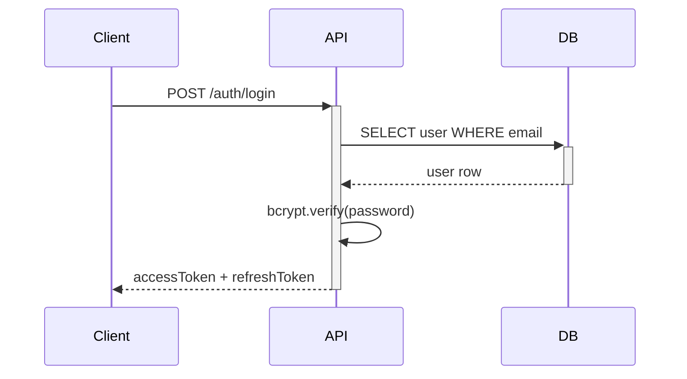

# Phase 2: Design

**What:** Decide how to build before coding. Prevents architecture regret.  
**Who:** Engineering (backend + frontend). AI agent drafts, human reviews.  
**When:** After PRD approved, before first line of code.

---

## Template Index

```
2_DESIGN/
│
├── 📐 SYSTEM (cross-cutting — both sides)
│   ├── ARCHITECTURE.md           ← System-wide decisions, patterns, tech debt
│   ├── ADR.md                    ← Architecture Decision Records (why we chose X)
│   └── DIAGRAMS/                 ← Mermaid diagrams: ERD, sequence, deployment, component
│
├── ⚙️ BACKEND                     ← How services, APIs, and data work
│   ├── DESIGN_SPEC.md            ← Technical design per feature (API + DB + security)
│   ├── HLDD/                     ← High-Level Design: module decomposition
│   │   └── HLDD_01_TITLE.md      ← Per-module: what it does, interfaces, dependencies
│   └── LLDD/                     ← Low-Level Design: class diagrams, DB schema detail
│       └── LLDD_01_TITLE.md      ← Per-component: methods, queries, error handling
│
└── 🎨 FRONTEND                    ← How the UI looks and behaves
    ├── UI_SPEC.md                ← Design tokens: colors, fonts, spacing, radius, shadows
    ├── PAGE_SPEC.md              ← Route map + per-page: data needs, states, interactions
    ├── COMPONENT_TREE.md         ← Component hierarchy: ui/ → layout/ → feature/ → shared/
    └── API_CONTRACT.md           ← What frontend expects from backend (shared truth)
```

---

## Which to Use When?

| You're Building... | Use |
|--------------------|-----|
| New feature with API + UI | ARCHITECTURE + DESIGN_SPEC + UI_SPEC + PAGE_SPEC + API_CONTRACT |
| API-only feature (no UI) | ARCHITECTURE + DESIGN_SPEC. Skip frontend files. |
| UI-only (backend exists) | UI_SPEC + PAGE_SPEC + COMPONENT_TREE + API_CONTRACT |
| Simple bug fix | None. Jump to 3_DEVELOPMENT. |
| Major refactor / new module | ARCHITECTURE + HLDD (for decomposition) + LLDD (for detail) |

---

## The Two-Sided Design Loop

```
           ┌──────────────────┐
           │   ARCHITECTURE   │  ← System-level: where things live
           └────────┬─────────┘
                    │
      ┌─────────────┼─────────────┐
      │                           │
      ▼                           ▼
┌───────────┐              ┌────────────┐
│  BACKEND  │              │  FRONTEND  │
│           │              │            │
│ DESIGN_   │◄──contract──▶│ UI_SPEC    │
│ SPEC      │   (API_      │ PAGE_SPEC  │
│ HLDD      │   CONTRACT)  │ COMPONENT_ │
│ LLDD      │              │ TREE       │
└───────────┘              └────────────┘
```

The **API_CONTRACT.md** is the bridge. Backend owns implementation. Frontend owns the contract document. When they disagree, the contract wins — update backend to match, or negotiate and update both.

---

## Workflow

### For Full-Stack Features (API + UI)

1. Agent reads PRD.md
2. Agent drafts ARCHITECTURE.md (system-level decisions)
3. Agent drafts DESIGN_SPEC.md (backend: API, DB, security)
4. Agent drafts UI_SPEC.md (frontend: tokens, components)
5. Agent drafts PAGE_SPEC.md (routes, data needs per page)
6. Agent drafts API_CONTRACT.md (the shared truth)
7. You review all. Backend and frontend are now decoupled — can build in parallel.

### Example Prompt (Full-Stack)

```
"Read PRD.md. Design the system:

Backend:
- DESIGN_SPEC.md: API contract, database schema, security considerations
- ARCHITECTURE.md: update with any new cross-cutting decisions

Frontend:
- UI_SPEC.md: color palette, typography, spacing, component library
- PAGE_SPEC.md: all routes, data requirements per page, states to handle
- API_CONTRACT.md: every endpoint, request/response shapes, error codes

Ask questions before drafting."
```

### For Backend-Only Feature

```
"Read PRD.md. Design the backend:
- DESIGN_SPEC.md with API contract, DB schema, security
- Update ARCHITECTURE.md if needed"
```

### For Frontend-Only (Backend Already Exists)

```
"Read the existing API docs. Design the frontend:
- UI_SPEC.md: design tokens matching existing brand
- PAGE_SPEC.md: routes + data needs per page
- COMPONENT_TREE.md: component hierarchy
- API_CONTRACT.md: document existing endpoints from frontend's perspective"
```

---

## Diagrams

Use Mermaid inside markdown. Renders on GitHub, VS Code, and most agents.



Store complex diagrams in `2_DESIGN/DIAGRAMS/` as `.mmd` files.

---

## Deliverables

- [ ] ARCHITECTURE.md updated (cross-cutting decisions)
- [ ] Backend: DESIGN_SPEC.md (or HLDD + LLDD for complex modules)
- [ ] Frontend: UI_SPEC.md (brand tokens)
- [ ] Frontend: PAGE_SPEC.md (all routes and states)
- [ ] Shared: API_CONTRACT.md (both sides agree)
- [ ] Diagrams for data flow, component architecture
